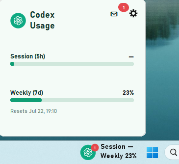
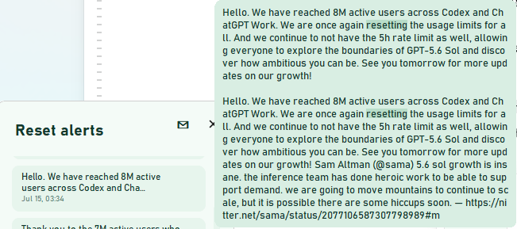

# Codex Usage Monitor

A lightweight Windows taskbar overlay for the Codex usage windows that can be verified from local Codex CLI session logs.


## Preview





## Features

- Lives directly in the Windows taskbar and can be dragged horizontally.
- Shows verified Weekly usage and, when available, Session usage.
- Opens a compact panel with reset times, refresh settings, launch-at-login, and instant Chinese/English switching.
- Includes a small public reset-message feed with unread badges and manual retry.
- Runs as a single instance, so launching it again will not create a second overlay.

## Data and privacy

- Usage is read locally from `%USERPROFILE%\.codex\sessions` JSONL logs created by Codex CLI.
- The app does **not** read browser cookies, access tokens, or OpenAI Platform/API usage data.
- The Messages view requests the public Nitter RSS feed for `@thsottiaux` once at startup. It can be refreshed manually if unavailable.
- If a verified value is unavailable, the app shows `—` or `Request failed`; it never invents a `0%` value.

> Codex may not expose a Session limit at all. In that case, the Session row remains unavailable while Weekly usage can still display.

## Install and use

Download `Codex-Usage-Monitor.exe` from the latest GitHub Release and run it. No installation is required.

- Left-click the taskbar overlay to open or close the panel.
- Right-click it for Panel, Settings, Messages, and Exit.
- Launch at login is enabled by default and can be changed in Settings.

Configuration and diagnostic logs are stored under:

```text
%LOCALAPPDATA%\Codex-Usage-Monitor\
```

## Build from source

Requires Windows and Python 3.11 or newer.

```powershell
python -m venv .venv
.\.venv\Scripts\python.exe -m pip install -e ".[dev]"
.\.venv\Scripts\python.exe -m pytest -q
.\build.ps1
```

The packaged executable is created at `dist\Codex-Usage-Monitor.exe`.

## Disclaimer

This is an independent, unofficial personal tool. It is not affiliated with or endorsed by OpenAI.

## License

MIT. See [LICENSE](LICENSE).
